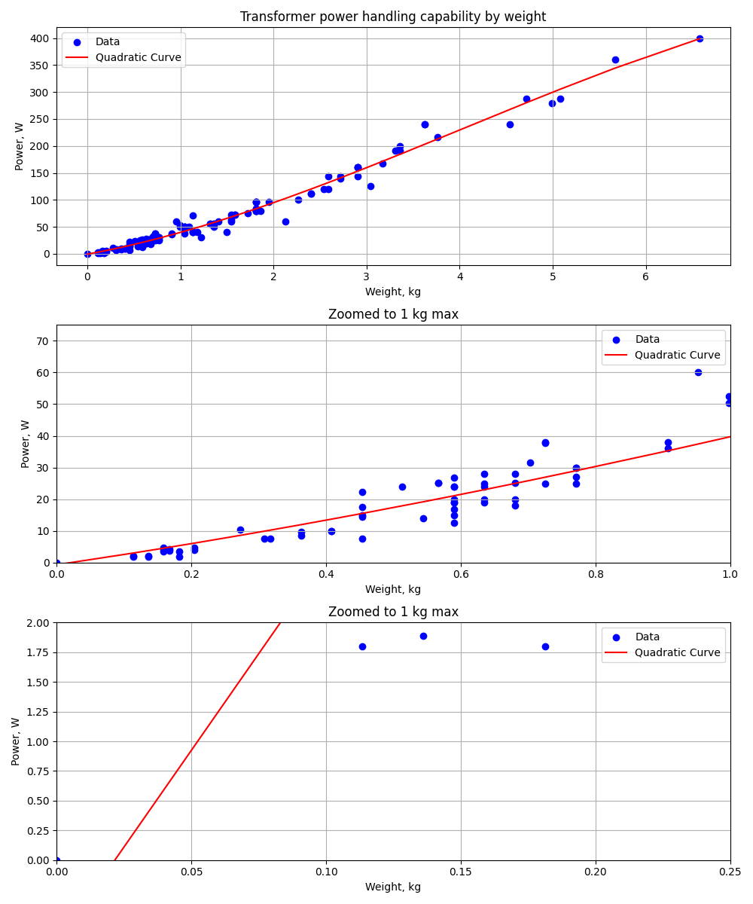

# How to

* Use the calculator.py to estimate power rating or use the chart below
* Convert to current
* Measure any winding resistance, Ra
* Use dummy load to run with this current for a few hours. Use concervative estimation first. Especially for multiple windings transformers.
* Transformer core temp should not exceed 105C. Optionally measure it
* Disconnect the load and power, measure the same winding resistance again, Rh
* Calculate internal core temp, as follow
* $Th = \frac{Rh}{Ra}*(234.5+Ta)-234.5+10$
* If it's below 105C you can draw more power
* Repeat until satisfied

# Source

https://forum.allaboutcircuits.com/threads/assessing-an-unknown-transformer.38273/post-243741

The weight of a commercial transformer is related to the power handling capability, but the relationship is not linear. I extracted parameters for 43 small to moderate size transformers from the Stancor catalog and plotted power handling versus weight. I did a curve fit to the data points, and the plot is shown in the first and second attachments. The 20 pounds per watt rule of thumb works fairly well around the 3.5 pound region.

Note that this is the total transformer weight--iron plus copper, not just the iron.

I also did a curve fit to the same transformers with area product as the independent variable. The result is shown in the third attachment.

The ultimate determinant of power handling capability is the allowable hot spot temperature. With class A insulation, typical for the transformers the hobbyist is likely to encounter, the allowable hot spot temperature is 105° C.

What one could do is use the graph of power handling vs weight to get a good estimate. Then measure the DC resistance of a winding on the transformer at ambient (room temp), which will probably be around 20° C. Next apply the load determined from the graph for several hours. Quickly disconnect the power and load, and measure the DC resistance of the winding. The temperature of the winding can be determined with the formula:

$Th = \frac{Rh}{Ra}*(234.5+Ta)-234.5+10$

Where Rh is the hot resistance of the winding, Ra is the resistance at ambient temperature (the starting temperature; room temperature), Ta is the ambient temperature, and Th is the hot spot temperature of the winding.

Since when the winding is hot, not all parts of it will be at the same temperature, the measured hot resistance will be a kind of average of the temperature of all the parts of the winding. A compensation for this effect is made by adding 10° to the calculated temperature.

After doing this a couple of times, one can interpolate and find the power supplied by the transformer which will just raise the hot spot temperature to 105°; that will be the rated power of the transformer.

Or, you can just use the graph and allow a safety factor.
